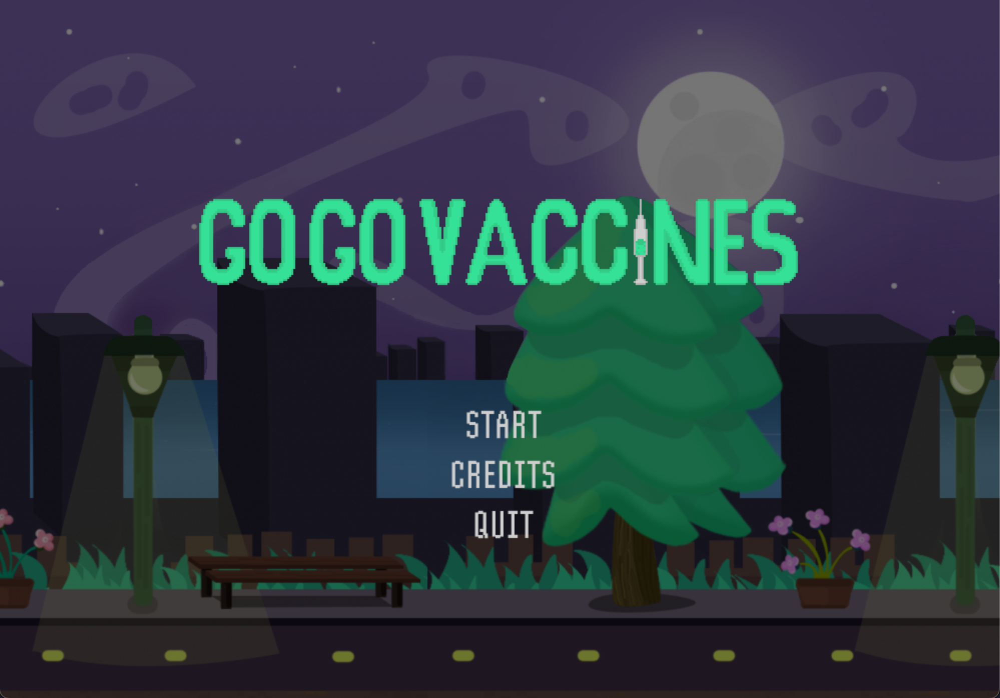
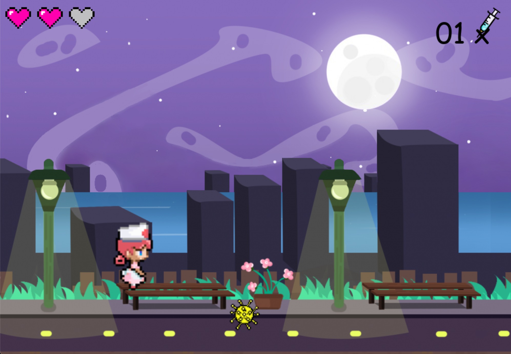
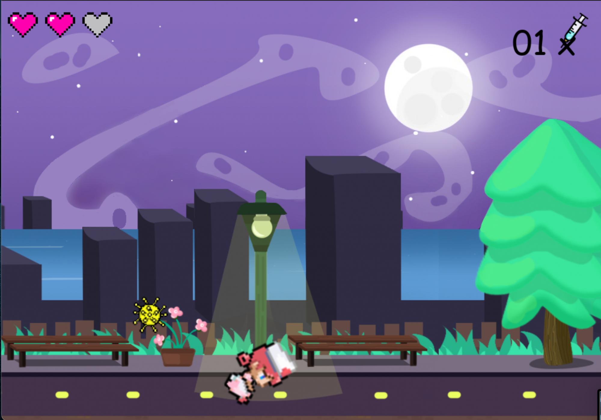
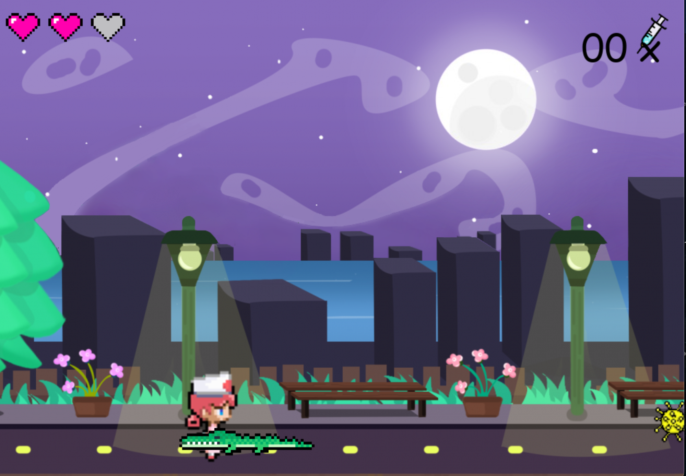
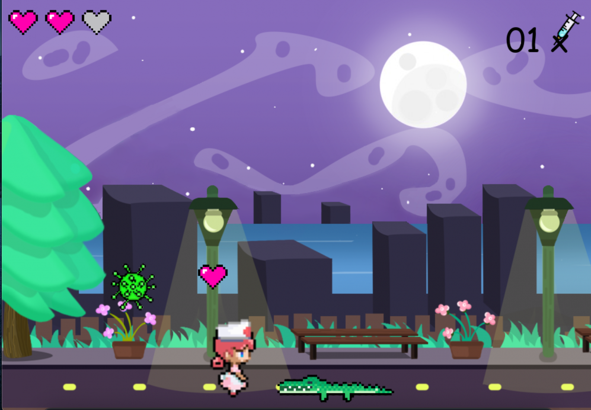
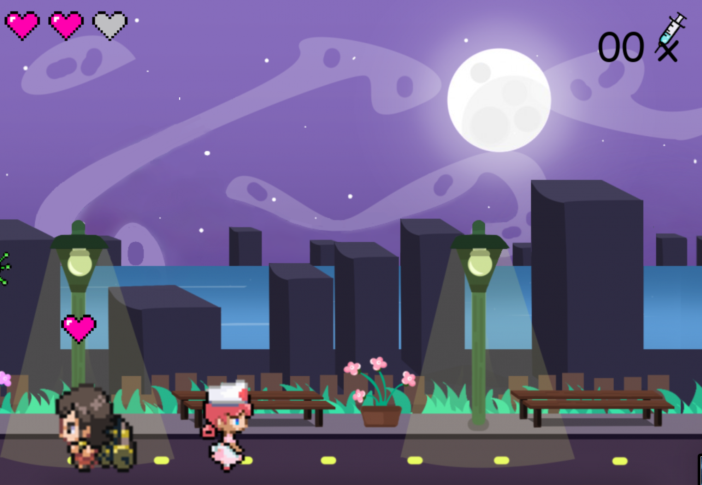

<!-- PROJECT LOGO -->
<br />
<p align="center">
  <a href="https://github.com/github_username/repo_name">
    
  </a>

  <h3 align="center">Go-Go Vaccines</h3>

  <p align="center">
Given the context of the pandemic, we decided to make an interactive system, based on the super mario game, which brings aspects of the covid in a playful way. In this way, through a game,  we encourage the application of vaccines and ways to protect against the virus. In addition, we use memes as a way to combat some aspects that emerged at the beginning of the pandemic, which defended the non-use of vaccine.
    <br />
    <a href="https://github.com/IgrPhillipe/go-go-vaccines"><strong>Explore the docs »</strong></a>
    <br />
    <br />
    ·
    <a href="https://github.com/IgrPhillipe/go-go-vaccines/issues?q=is%3Aopen+is%3Aissue">Report Bug</a>
    ·
    <a href="https://github.com/IgrPhillipe/go-go-vaccines/issues?q=is%3Aopen+is%3Aissue">Request Feature</a>
  </p>
</p>


<!-- TABLE OF CONTENTS -->
<details open="open">
  <summary><h2 style="display: inline-block">Table of Contents</h2></summary>
  <ol>
    <li><a href="#contributors">Contributors</a></li>
    <li>
      <a href="#about-the-project">About The Project</a>
      <ul>
        <li><a href="#built-with">Built With</a></li>
      </ul>
    </li>
    <li>
      <a href="#installation">Installation</a>
    </li>
    <li><a href="#play">How To Run</a></li>
    <li><a href="#usage">Usage</a></li>
    <li><a href="#contact">Contact</a></li>
  </ol>
</details>

## Contributors


<table>
  <tr>
<td align="center"><a href="https://github.com/apfdamascena"><br /><sub><b>Alex Damascena</b></sub></a><br/></td>

<td align="center"><a href="https://github.com/Sofiamdl"><br /><sub><b>Sofia Melo</b></sub></a><br/></td>

<td align="center"><a href="https://github.com/IgrPhillipe"><br /><sub><b>Igor Phillipe</b></sub></a><br/></td>

</tr>
 </table>


## About The Project

Given the context of the pandemic, we decided to make an interactive system, based on the super mario game, which brings aspects of the covid in a playful way. In this way, through a game,  we encourage the application of vaccines and ways to protect against the virus. In addition, we use memes as a way to combat some aspects that emerged at the beginning of the pandemic, which defended the non-use of vaccine.

- <strong>TAKE VACCINE AND PROTECT YOURSELF</strong>

### Built With

* [ Python 3.8 ]( https://www.python.org/ )
* [Pygame 2.0.1 ]( https://www.pygame.org/wiki/GettingStarted )

### Installation

1. Clone the repo

   ```sh
   git clone https://github.com/IgrPhillipe/go-go-vaccines.git
   ```
2. Enter the root folder of the cloned repository

3. Install the dependencies

    <br>

   ```sh
   pip install -r requirements.txt
   ```
    ```sh
   pip3 install -r requirements.txt
   ```
    <strong>Use pip3 only if the computer contains different versions of python</strong>


## Play

1. In your terminal, go to the root folder
2. Run the instruction below
    <br>

   ```sh
   python3 Game.py
   ```
## Usage

- <strong>Instructions to play </strong>
    1. Use the arrow keys on your keyboard to move the nurse. There is the possibility to use the space keyboard to jump.
    2. Use the arrow keys on your keyboard to dodge viruses. Collision with the virus shortens the nurse's life
    3. If you have lost any life, the game will spawn hearts for you to collect. If you collected, your life will increase.
    4. The game will also spawn vaccines. When purchasing the vaccine, we leave it up to you whether you want to apply the vaccine to crocodiles that appear or not.
    5. If you apply the vaccine to crocodiles, they will become human. Remember: try to apply the vaccine without any vaccine, your life will decrease.
    6. Try to turn crocodiles into humans !!! And have fun !!!

- <strong>Some images to understand what I'm talking about</strong>

| | | |
|:-------------------------:|:-------------------------:|:-------------------------:|
|  Options |   Movement| Movement
|  Crocodile Collision |   Crocodile| Human Transformation


## Contributing

Any contributions you make are **greatly appreciated**.

1. Fork the Project
2. Create your Feature Branch (`git checkout -b feature/featureName`)
3. Commit your Changes (`git commit -m 'Add some featureName'`)
4. Push to the Branch (`git push origin feature/featureName`)
5. Open a Pull Request

## Contact

- Alex Damsacena - apfd@cin.ufpe.br
- Sofia Melo - sml@cin.ufpe.br
- Igor Phillipe - IgrPhillipe@gmail.com


<!-- MARKDOWN LINKS & IMAGES -->
<!-- https://www.markdownguide.org/basic-syntax/#reference-style-links -->
[contributors-shield]: https://img.shields.io/github/contributors/github_username/repo.svg?style=for-the-badge
[contributors-url]: https://github.com/github_username/repo/graphs/contributors
[forks-shield]: https://img.shields.io/github/forks/github_username/repo.svg?style=for-the-badge
[forks-url]: https://github.com/github_username/repo/network/members
[stars-shield]: https://img.shields.io/github/stars/github_username/repo.svg?style=for-the-badge
[stars-url]: https://github.com/github_username/repo/stargazers
[issues-shield]: https://img.shields.io/github/issues/github_username/repo.svg?style=for-the-badge
[issues-url]: https://github.com/github_username/repo/issues
[license-shield]: https://img.shields.io/github/license/github_username/repo.svg?style=for-the-badge
[license-url]: https://github.com/github_username/repo/blob/master/LICENSE.txt
[linkedin-shield]: https://img.shields.io/badge/-LinkedIn-black.svg?style=for-the-badge&logo=linkedin&colorB=555
[linkedin-url]: https://linkedin.com/in/github_username
